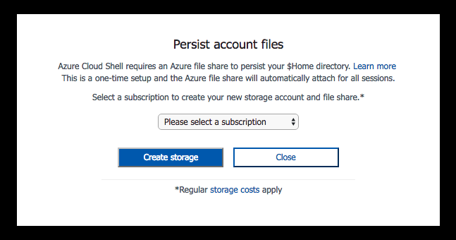

# <a name="get-started-with-azure-cli-20"></a><span data-ttu-id="6967d-104">Kom igång med Azure CLI 2.0</span><span class="sxs-lookup"><span data-stu-id="6967d-104">Get started with Azure CLI 2.0</span></span>

<span data-ttu-id="6967d-105">Azure CLI 2.0 är Azures nya kommandoradsmiljö för att hantera Azure-resurser.</span><span class="sxs-lookup"><span data-stu-id="6967d-105">The Azure CLI 2.0 is Azure's new command line experience for managing Azure resources.</span></span>
<span data-ttu-id="6967d-106">Du kan använda den i din webbläsare med [Azure Cloud Shell](/azure/cloud-shell/overview) eller [installera](install-azure-cli.md) den på macOS, Linux och Windows och köra den från kommandoraden.</span><span class="sxs-lookup"><span data-stu-id="6967d-106">You can use it in your browser with [Azure Cloud Shell](/azure/cloud-shell/overview), or you can [install](install-azure-cli.md) it on macOS, Linux, and Windows and run it from the command line.</span></span>

<span data-ttu-id="6967d-107">Azure CLI 2.0 är optimerad för att hantera och administrera Azure-resurser från kommandoraden och för att skapa automatiseringsskript som fungerar mot Azure Resource Manager.</span><span class="sxs-lookup"><span data-stu-id="6967d-107">Azure CLI 2.0 is optimized for managing and administering Azure resources from the command line, and for building automation scripts that work against the Azure Resource Manager.</span></span>
<span data-ttu-id="6967d-108">Den här artikeln hjälper dig att komma igång med att använda det och lär dig grundbegreppen bakom.</span><span class="sxs-lookup"><span data-stu-id="6967d-108">This article helps get you started using it, and teaches you the core concepts behind it.</span></span>

<span data-ttu-id="6967d-109">Information om den senaste versionen finns i [viktig information](release-notes-azure-cli.md).</span><span class="sxs-lookup"><span data-stu-id="6967d-109">For information about the latest release, see the [release notes](release-notes-azure-cli.md).</span></span>

## <a name="connect"></a><span data-ttu-id="6967d-110">Anslut</span><span class="sxs-lookup"><span data-stu-id="6967d-110">Connect</span></span>

<span data-ttu-id="6967d-111">Det enklaste sättet att komma igång är att [starta Cloud Shell](/azure/cloud-shell/quickstart).</span><span class="sxs-lookup"><span data-stu-id="6967d-111">The simplest way to get started is to [launch Cloud Shell](/azure/cloud-shell/quickstart).</span></span>

1. <span data-ttu-id="6967d-112">Starta Cloud Shell från det övre navigeringsfältet i Azure Portal.</span><span class="sxs-lookup"><span data-stu-id="6967d-112">Launch Cloud Shell from the top navigation of the Azure portal.</span></span>

   

2. <span data-ttu-id="6967d-114">Välj den prenumeration du vill använda och skapa ett lagringskonto.</span><span class="sxs-lookup"><span data-stu-id="6967d-114">Choose the subscription you want to use and create a storage account.</span></span>

   

<span data-ttu-id="6967d-116">Du kan även [installera](install-azure-cli.md) CLI och köra det lokalt från kommandoraden.</span><span class="sxs-lookup"><span data-stu-id="6967d-116">You can also [install](install-azure-cli.md) the CLI and run it locally from the command line.</span></span>

## <a name="create-a-resource-group"></a><span data-ttu-id="6967d-117">Skapa en resursgrupp</span><span class="sxs-lookup"><span data-stu-id="6967d-117">Create a Resource Group</span></span>

<span data-ttu-id="6967d-118">Nu när allt har konfigurerats ska vi använda Azure CLI för att skapa resurser i Azure.</span><span class="sxs-lookup"><span data-stu-id="6967d-118">Now that we've got everything set up, let's use the Azure CLI to create resources within Azure.</span></span>

<span data-ttu-id="6967d-119">Skapa först en resursgrupp.</span><span class="sxs-lookup"><span data-stu-id="6967d-119">First, create a Resource Group.</span></span>  <span data-ttu-id="6967d-120">Resursgrupper i Azure är ett sätt att hantera flera logiskt grupperade resurser.</span><span class="sxs-lookup"><span data-stu-id="6967d-120">Resource Groups in Azure provide a way to manage multiple resources that you want to logically group.</span></span>  <span data-ttu-id="6967d-121">Du kan till exempel skapa en resursgrupp för ett program eller projekt och lägga till en virtuell dator, en databas och en CDN-tjänst inom den.</span><span class="sxs-lookup"><span data-stu-id="6967d-121">For example, you might create a Resource Group for an application or project and add a virtual machine, a database and a CDN service within it.</span></span>

<span data-ttu-id="6967d-122">Vi ska skapa en resursgrupp med namnet "MyResourceGroup" i regionen *westus2* för Azure.</span><span class="sxs-lookup"><span data-stu-id="6967d-122">Let's create a resource group named "MyResourceGroup" in the *westus2* region of Azure.</span></span>  <span data-ttu-id="6967d-123">Ange följande kommando:</span><span class="sxs-lookup"><span data-stu-id="6967d-123">To do so type the following command:</span></span>

```azurecli-interactive
az group create -n MyResourceGroup -l westus2 
```

<span data-ttu-id="6967d-124">När resursgruppen har skapas ger kommandot `az group create` flera egenskaper för den nyligen skapade resursen:</span><span class="sxs-lookup"><span data-stu-id="6967d-124">Once the resource group has been created, the `az group create` command outputs several properties of the newly created resource:</span></span>

```Output
{
  "id": "/subscriptions/XXXXXXXX-XXXX-XXXX-XXXX-XXXXXXXXXXXX/resourceGroups/MyResourceGroup",
  "location": "westus2",
  "managedBy": null,
  "name": "MyResourceGroup",
  "properties": {
    "provisioningState": "Succeeded"
  },
  "tags": null
}
```

## <a name="create-a-linux-virtual-machine"></a><span data-ttu-id="6967d-125">Skapa en virtuell Linux-dator</span><span class="sxs-lookup"><span data-stu-id="6967d-125">Create a Linux Virtual Machine</span></span>

<span data-ttu-id="6967d-126">Nu när vi har en resursgrupp kan vi skapa en virtuell Linux-dator i den.</span><span class="sxs-lookup"><span data-stu-id="6967d-126">Now that we have our resource group, let's create a Linux VM within it.</span></span>

<span data-ttu-id="6967d-127">Du kan skapa en virtuell Linux-dator med den populära UbuntuLTS-avbildningen med två anslutna lagringsdiskar på 10 GB och 20 GB med följande kommando:</span><span class="sxs-lookup"><span data-stu-id="6967d-127">You can create a Linux VM using the popular UbuntuLTS image, with two attached storage disks of 10 GB and 20 GB, with the following command:</span></span>

```azurecli-interactive
az vm create -n MyLinuxVM -g MyResourceGroup --image UbuntuLTS --data-disk-sizes-gb 10 20
```

<span data-ttu-id="6967d-128">När du kör föregående kommando letar Azure CLI 2.0 efter ett SSH-nyckelpar som är lagrat under katalogen ~/.ssh.</span><span class="sxs-lookup"><span data-stu-id="6967d-128">When you run the preceding command, the Azure CLI 2.0 looks for an SSH key pair stored under your ~/.ssh directory.</span></span>  <span data-ttu-id="6967d-129">Om du inte redan har ett SSH-nyckelpar lagrat där kan du be att Azure CLI automatiskt skapar en åt dig genom att skicka parametern --generate-ssh-keys:</span><span class="sxs-lookup"><span data-stu-id="6967d-129">If you don't already have an SSH key pair stored there, you can ask the Azure CLI to automatically create one for you by passing the --generate-ssh-keys parameter:</span></span>

```azurecli-interactive
az vm create -n MyLinuxVM -g MyResourceGroup --image UbuntuLTS --data-disk-sizes-gb 10 20 --generate-ssh-keys
```

<span data-ttu-id="6967d-130">Kommandot `az vm create` ger resultat när den virtuella datorn har skapats färdigt och är redo att nås och användas.</span><span class="sxs-lookup"><span data-stu-id="6967d-130">The `az vm create` command returns output once the VM has been fully created and is ready to be accessed and used.</span></span> <span data-ttu-id="6967d-131">Utdata innehåller flera egenskaper för den nyligen skapade virtuella datorn inklusive dess offentliga IP-adress:</span><span class="sxs-lookup"><span data-stu-id="6967d-131">The output includes several properties of the newly created VM including its public IP address:</span></span>

```Output
{
  "fqdns": "",
  "id": "/subscriptions/XXXXXXXX-XXXX-XXXX-XXXX-XXXXXXXXXXXX/resourceGroups/MyResourceGroup/providers/Microsoft.Compute/virtualMachines/MyLinuxVM",
  "location": "westus2",
  "macAddress": "xx-xx-xx-xx-xx-xx",
  "powerState": "VM running",
  "privateIpAddress": "xx.x.x.x",
  "publicIpAddress": "xx.xxx.xxx.xx",
  "resourceGroup": "MyResourceGroup"
}
```

<span data-ttu-id="6967d-132">Nu när den virtuella datorn har skapats kan du logga in på den nya virtuella Linux-datorn med hjälp av **SSH** med den offentliga IP-adressen för den virtuella dator du skapade:</span><span class="sxs-lookup"><span data-stu-id="6967d-132">Now that the VM has been created, you can log on to your new Linux VM using **SSH** with the public IP address of the VM you created:</span></span>

```azurecli-interactive
ssh xx.xxx.xxx.xxx
```

```Output
Welcome to Ubuntu 14.04.4 LTS (GNU/Linux 3.19.0-65-generic x86_64)

 * Documentation:  https://help.ubuntu.com/

  System information as of Sun Feb 19 00:32:28 UTC 2017

  System load: 0.31              Memory usage: 3%   Processes:       89
  Usage of /:  39.6% of 1.94GB   Swap usage:   0%   Users logged in: 0

  Graph this data and manage this system at:
    https://landscape.canonical.com/

  Get cloud support with Ubuntu Advantage Cloud Guest:
    http://www.ubuntu.com/business/services/cloud

0 packages can be updated.
0 updates are security updates.


The programs included with the Ubuntu system are free software;
the exact distribution terms for each program are described in the
individual files in /usr/share/doc/*/copyright.

Ubuntu comes with ABSOLUTELY NO WARRANTY, to the extent permitted by
applicable law.

my-login@MyLinuxVM:~$
```

## <a name="create-a-windows-server-virtual-machine"></a><span data-ttu-id="6967d-133">Skapa en virtuell Windows Server-dator</span><span class="sxs-lookup"><span data-stu-id="6967d-133">Create a Windows Server Virtual Machine</span></span>

<span data-ttu-id="6967d-134">Nu ska vi skapa en Windows Server 2016 Datacenter-baserad virtuell dator med kommandot `az vm create` och lägga till den i samma ”MyResourceGroup”-resursgrupp som vi använde för vår virtuella Linux-dator.</span><span class="sxs-lookup"><span data-stu-id="6967d-134">Let's now create a Windows Server 2016 Datacenter-based VM using the `az vm create` command and add it to the same "MyResourceGroup" resource group that we used for our Linux VM.</span></span>  <span data-ttu-id="6967d-135">Precis som i exemplet med den virtuella Linux-datorn ansluter vi två lagringsdiskar med parmetern `--data-disk-sizes-gb`.</span><span class="sxs-lookup"><span data-stu-id="6967d-135">Like the Linux VM example, we'll also attach two storage disks using the `--data-disk-sizes-gb` parameter.</span></span>

<span data-ttu-id="6967d-136">Azure kräver att du undviker att använda användarnamn/lösenord som är lätta att lista ut.</span><span class="sxs-lookup"><span data-stu-id="6967d-136">Azure requires that you avoid using easily guessed usernames/passwords.</span></span> <span data-ttu-id="6967d-137">Det finns särskilda regler för vilka tecken som kan användas och minimilängd för både användarnamn och lösenord.</span><span class="sxs-lookup"><span data-stu-id="6967d-137">There are specific rules for what characters can be used as well as the minimum length of both username and password.</span></span>  

> [!NOTE]
> <span data-ttu-id="6967d-138">Du ombeds ange ditt användarnamn och lösenord när du kör det här kommandot.</span><span class="sxs-lookup"><span data-stu-id="6967d-138">You will be prompted to enter your username and password when running this command.</span></span>

```azurecli-interactive
az vm create -n MyWinVM -g MyResourceGroup --image Win2016Datacenter
```

<span data-ttu-id="6967d-139">Kommandot `az vm create` ger resultat när den virtuella datorn har skapats färdigt och är redo att nås och användas.</span><span class="sxs-lookup"><span data-stu-id="6967d-139">The `az vm create` command output results once the VM has been fully created and is ready to be accessed and used.</span></span>

```Output
{
  "fqdns": "",
  "id": "/subscriptions/XXXXXXXX-XXXX-XXXX-XXXX-XXXXXXXXXXXX/resourceGroups/MyResourceGroup/providers/Microsoft.Compute/virtualMachines/MyWinVM",
  "location": "westus2",
  "macAddress": "xx-xx-xx-xx-xx-xx",
  "powerState": "VM running",
  "privateIpAddress": "xx.x.x.x",
  "publicIpAddress": "xx.xxx.xx.xxx",
  "resourceGroup": "MyResourceGroup"
}
```

<span data-ttu-id="6967d-140">Logga nu in på den virtuella Windows Server-dator som har skapats med hjälp av Fjärrskrivbord och den virtuella datorns offentliga IP-adress (som returneras i resultatet från `az vm create`).</span><span class="sxs-lookup"><span data-stu-id="6967d-140">Now log on to your newly created Windows Server VM using Remote Desktop and the public IP address of the VM (which is returned in the output from `az vm create`).</span></span>  
<span data-ttu-id="6967d-141">Om du använder ett Windows-baserat system kan du göra detta från kommandoraden med `mstsc`-kommandot:</span><span class="sxs-lookup"><span data-stu-id="6967d-141">If you are on a Windows-based system, you can do this from the command line using the `mstsc` command:</span></span>

```azurecli-interactive
mstsc /v:xx.xxx.xx.xxx
```

<span data-ttu-id="6967d-142">Ange samma kombination av användarnamn/lösenord för att logga in som du använde när du skapade den virtuella datorn.</span><span class="sxs-lookup"><span data-stu-id="6967d-142">Supply the same username/password combination you used when creating the VM to log in.</span></span>

## <a name="creating-other-resources-in-azure"></a><span data-ttu-id="6967d-143">Skapa andra resurser i Azure</span><span class="sxs-lookup"><span data-stu-id="6967d-143">Creating other resources in Azure</span></span>

<span data-ttu-id="6967d-144">Vi har nu gått igenom hur du skapar en resursgrupp, en virtuell Linux-dator och en virtuell Windows Server-dator.</span><span class="sxs-lookup"><span data-stu-id="6967d-144">We've now walked through how to create a Resource Group, a Linux VM, and a Windows Server VM.</span></span> <span data-ttu-id="6967d-145">Du kan även skapa många andra typer av Azure-resurser.</span><span class="sxs-lookup"><span data-stu-id="6967d-145">You can create many other types of Azure resources as well.</span></span>  

<span data-ttu-id="6967d-146">Alla nya resurser skapas med ett konsekvent `az <resource type name> create`-namngivningsmönster.</span><span class="sxs-lookup"><span data-stu-id="6967d-146">All new resources are created using a consistent `az <resource type name> create` naming pattern.</span></span>  <span data-ttu-id="6967d-147">Om du till exempel vill skapa en belastningsutjämnare för Azure-nätverk som vi sedan kan koppla till de virtuella datorer vi precis har skapat kan vi använda följande kommando för att skapa:</span><span class="sxs-lookup"><span data-stu-id="6967d-147">For example, to create an Azure Network Load Balancer that we could then associate with our newly created VMs, we can use the following create command:</span></span>

```azurecli-interactive
az network lb create -n MyLoadBalancer -g MyResourceGroup
```

<span data-ttu-id="6967d-148">Vi kan också skapa ett nytt privat virtuellt nätverk (som ofta kallas ett "VNet" i Azure) för infrastrukturen med följande kommando för skapande:</span><span class="sxs-lookup"><span data-stu-id="6967d-148">We could also create a new private Virtual Network (commonly referred to as a "VNet" within Azure) for our infrastructure using the following create command:</span></span>

```azurecli-interactive
az network vnet create -n MyVirtualNetwork -g MyResourceGroup --address-prefix 10.0.0.0/16
```

<span data-ttu-id="6967d-149">Det som gör Azure och Azure CLI så kraftfulla är att vi kan använda dem inte bara för att få molnbaserad infrastruktur, utan också för att skapa hanterade plattformstjänster.</span><span class="sxs-lookup"><span data-stu-id="6967d-149">What makes Azure and the Azure CLI powerful is that we can use it not just to get cloud-based infrastructure but also to create managed platform services.</span></span>  <span data-ttu-id="6967d-150">De hanterade plattformstjänsterna kan också kombineras med infrastruktur för att skapa ännu mer kraftfulla lösningar.</span><span class="sxs-lookup"><span data-stu-id="6967d-150">The managed platform services can also be combined with infrastructure to build even more powerful solutions.</span></span>

<span data-ttu-id="6967d-151">Du kan till exempel använda Azure CLI för att skapa en Azure AppService.</span><span class="sxs-lookup"><span data-stu-id="6967d-151">For example, you can use the Azure CLI to create an Azure AppService.</span></span>  <span data-ttu-id="6967d-152">Azure AppService är en hanterad plattformstjänst som ger ett utmärkt sätt att agera värd för webbappar utan att behöva bekymra sig över infrastruktur.</span><span class="sxs-lookup"><span data-stu-id="6967d-152">Azure AppService is a managed platform service that provides a great way to host web apps without having to worry about infrastructure.</span></span>  <span data-ttu-id="6967d-153">När du har skapat Azure AppService kan du skapa två nya Azure-webbappar i AppService med hjälp av följande kommandon för skapande:</span><span class="sxs-lookup"><span data-stu-id="6967d-153">After creating the Azure AppService, you can create two new Azure Web Apps within the AppService using the following create commands:</span></span>

```azurecli-interactive
# Create an Azure AppService that we can host any number of web apps within
az appservice plan create -n MyAppServicePlan -g MyResourceGroup

# Create Two Web Apps within the AppService (note: name param must be a unique DNS entry)
az webapp create -n MyWebApp43432 -g MyResourceGroup --plan MyAppServicePlan 
az webapp create -n MyWebApp43433 -g MyResourceGroup --plan MyAppServicePlan 
```

<span data-ttu-id="6967d-154">När du förstår grunderna i `az <resource type name> create`-mönstret blir det lätt att skapa vad som helst.</span><span class="sxs-lookup"><span data-stu-id="6967d-154">Once you understand the basics of the `az <resource type name> create` pattern, it becomes easy to create anything.</span></span> <span data-ttu-id="6967d-155">Här följer några populära Azure-resurstyper och motsvarande Azure CLI-create-kommandon för att skapa dem:</span><span class="sxs-lookup"><span data-stu-id="6967d-155">Following are some popular Azure resource types and the corresponding Azure CLI create commands to create them:</span></span>

```
Resource Type               Azure CLI create command
-------------               ------------------------
Resource Group              az group create
Virtual Machine             az vm create
Virtual Network             az network vnet create
Load Balancer               az network lb create
Managed Disk                az disk create
Storage account             az storage account create
Virtual Machine Scale Set   az vmss create
Azure Container Service     az acs create
Web App                     az webapp create
SQL Database Server         az sql server create
Document DB                 az documentdb create
```

<span data-ttu-id="6967d-156">Besök [Referensdokumentation](/cli/azure) för att läsa om de ytterligare resursspecifika parametrarna du kan skicka till vart och ett av de föregående kommandona och resurstyperna du kan skapa.</span><span class="sxs-lookup"><span data-stu-id="6967d-156">Visit the [Reference documentation](/cli/azure) to learn more about the additional resource-specific parameters that you can pass to each of the preceding commands and the resource types you can create.</span></span> 

## <a name="useful-tip-optimizing-create-operations-using---no-wait"></a><span data-ttu-id="6967d-157">Användbart tips: Optimera skapandeåtgärder med hjälp av --no-wait</span><span class="sxs-lookup"><span data-stu-id="6967d-157">Useful tip: Optimizing create operations using --no-wait</span></span>

<span data-ttu-id="6967d-158">Som standard när du skapar resurser med Azure CLI 2.0 väntar kommandot `az <resource type name> create` tills resursen har skapats och är klar att användas.</span><span class="sxs-lookup"><span data-stu-id="6967d-158">By default when you create resources using the Azure CLI 2.0, the `az <resource type name> create` command waits until the resource has been created and is ready for you to use.</span></span>  <span data-ttu-id="6967d-159">Om du exempelvis skapar en virtuell dator returnerar inte kommandot `az vm create` som standard förrän den virtuella datorn är skapad och klar att användas med SSH eller RDP.</span><span class="sxs-lookup"><span data-stu-id="6967d-159">For example, if you create a VM, the `az vm create` command will, by default, not return until the VM is created and is ready for you to SSH or RDP into it.</span></span>

<span data-ttu-id="6967d-160">Vi använder den här metoden eftersom det gör det enklare att skriva automatiseringsskript som innehåller flera steg med beroenden (och som behöver ha en föregående uppgift slutförd innan det går att fortsätta).</span><span class="sxs-lookup"><span data-stu-id="6967d-160">We use this approach because it makes it easier to write automation scripts that contain multiple steps with dependencies (and need a prior task to have completed successfully before continuing).</span></span>

<span data-ttu-id="6967d-161">Om du inte behöver vänta på att skapa en resurs innan du fortsätter kan du använda alternativet `no-wait` för att påbörja en skapandeåtgärd i bakgrunden.</span><span class="sxs-lookup"><span data-stu-id="6967d-161">If you do not need to wait on creation of a resource before continuing, you can use the `no-wait` option to start a create action in the background.</span></span> <span data-ttu-id="6967d-162">Du kan fortsätta att använda CLI:n för andra kommandon.</span><span class="sxs-lookup"><span data-stu-id="6967d-162">You can continue using the CLI for other commands.</span></span>

<span data-ttu-id="6967d-163">Till exempel startar följande användning av `az vm create` en VM-distribution och returnerar sedan mycket snabbare (och innan den virtuella datorn har startats fullständigt):</span><span class="sxs-lookup"><span data-stu-id="6967d-163">For example, the following usage of the `az vm create` starts a VM deployment and then return much more quickly (and before the VM has fully booted):</span></span>

```azurecli-interactive
az vm create -n MyLinuxVM2 -g MyResourceGroup --image UbuntuLTS --no-wait
```

<span data-ttu-id="6967d-164">Med metoden `--no-wait` kan du få hjälp att optimera prestanda för dina automatiseringsskript avsevärt.</span><span class="sxs-lookup"><span data-stu-id="6967d-164">Using the `--no-wait` approach can help you optimize the performance of your automation scripts considerably.</span></span>

## <a name="listing-resources-and-formatting-output"></a><span data-ttu-id="6967d-165">Lista över resurser och formatering av utdata</span><span class="sxs-lookup"><span data-stu-id="6967d-165">Listing resources and formatting output</span></span>

<span data-ttu-id="6967d-166">Du kan använda kommandot `list` i Azure CLI för att söka efter och lista de resurser som körs i Azure.</span><span class="sxs-lookup"><span data-stu-id="6967d-166">You can use the `list` command within the Azure CLI to find and list the resources running in Azure.</span></span> 

<span data-ttu-id="6967d-167">Precis som med kommandot create kan du lista resurser med Azure CLI 2.0 med ett vanligt `az <resource type name> list`-namngivningsmönster som är konsekvent för alla resurstyper.</span><span class="sxs-lookup"><span data-stu-id="6967d-167">Like with the create command, you can list resources using the Azure CLI 2.0 using a common `az <resource type name> list` naming pattern that is consistent across all resource types.</span></span>  <span data-ttu-id="6967d-168">Det finns olika utdataformat och frågealternativ för att filtrera och sortera resurslistan som du önskar.</span><span class="sxs-lookup"><span data-stu-id="6967d-168">There are various output formats and query options available to filter and sort the list of resources in the way you prefer to see them.</span></span>

<span data-ttu-id="6967d-169">Till exempel visar `az vm list` listan över alla virtuella datorer du har.</span><span class="sxs-lookup"><span data-stu-id="6967d-169">For example, `az vm list` shows the list of all VMs you have.</span></span>   

```azurecli-interactive
az vm list 
```
<span data-ttu-id="6967d-170">Värdena som returneras är som standard i JSON (visar endast partiella utdata för att hålla det kortfattat).</span><span class="sxs-lookup"><span data-stu-id="6967d-170">The values returned are by default in JSON (only showing partial output for sake of brevity).</span></span>

```json
[
  {
    "availabilitySet": null,
    "diagnosticsProfile": null,
    "hardwareProfile": {
      "vmSize": "Standard_DS1_v2"
    },
    "id": "/subscriptions/XXXXXXXX-XXXX-XXXX-XXXX-XXXXXXXXXXXX/resourceGroups/DEMORG1/providers/Microsoft.Compute/virtualMachines/DemoVM010",
    "instanceView": null,
    "licenseType": null,
    "location": "westus2",
    "name": "MyLinuxVM",
    "networkProfile": {
      "networkInterfaces": [
        {
          "id": "/subscriptions/XXXXXXXX-XXXX-XXXX-XXXX-XXXXXXXXXXXX/resourceGroups/demorg1/providers/Microsoft.Network/networkInterfaces/DemoVM010VMNic",
          "primary": null,
          "resourceGroup": "MyResourceGroup"
        }
      ]
    },
          ...
          ...
          ...   
]
```

<span data-ttu-id="6967d-171">Du kan ändra utdataformat med alternativet `--output`.</span><span class="sxs-lookup"><span data-stu-id="6967d-171">You can optionally modify the output format using the `--output` option.</span></span>  <span data-ttu-id="6967d-172">Kör kommandot `az vm list` för att se både virtuella Linux- och Windows Server-datorer som skapats tidigare, tillsammans med de vanligaste egenskaperna hos en virtuell dator, med det lättlästa *tabellformatalternativet*:</span><span class="sxs-lookup"><span data-stu-id="6967d-172">Run the `az vm list` command to see both the Linux and Windows Server VMs created earlier, along with the most common properties of a VM, using the easy to read *table* format option:</span></span>

```azurecli-interactive
az vm list --output table
```

```Output
Name       ResourceGroup    Location
---------  ---------------  ----------
MyLinuxVM  MyResourceGroup  westus2
MyWinVM    MyResourceGroup  westus2
```

<span data-ttu-id="6967d-173">Utdataalternativet *tsv* kan användas för att få textbaserade, tabbavgränsade utdata utan rubriker.</span><span class="sxs-lookup"><span data-stu-id="6967d-173">The *tsv* output option can be used to get a text-based, tab-separated format without any headers.</span></span>  <span data-ttu-id="6967d-174">Det här formatet är praktiskt när du vill skicka utdata till något annat textbaserat verktyg som grep.</span><span class="sxs-lookup"><span data-stu-id="6967d-174">This format is useful when you want to pipe the output into another text-based tool like grep.</span></span> 

```azurecli-interactive
az vm list --output tsv
```

```
None    None            /subscriptions/XXXXXXXX-XXXX-XXXX-XXXX-XXXXXXXXXXXX/resourceGroups/MyResourceGroup/providers/Microsoft.Compute/virtualMachines/MyLinuxVM        None    None    westus2 MyLinuxVM                   None        Succeeded       MyResourceGroup None                    Microsoft.Compute/virtualMachines       XXXXXXXX-XXXX-XXXX-XXXX-XXXXXXXXXXXX
None    None            /subscriptions/XXXXXXXX-XXXX-XXXX-XXXX-XXXXXXXXXXXX/resourceGroups/MyResourceGroup/providers/Microsoft.Compute/virtualMachines/MyWinVM  None    None    westus2 MyWinVM                 None    Succeeded       MyResourceGroup None                    Microsoft.Compute/virtualMachines       XXXXXXXX-XXXX-XXXX-XXXX-XXXXXXXXXXXX
```
<span data-ttu-id="6967d-175">Läs artiklarna om [utdataformat](format-output-azure-cli.md) för att lära dig mer om fler sätt att lista resurser och formatera utdata.</span><span class="sxs-lookup"><span data-stu-id="6967d-175">Visit the [output formats](format-output-azure-cli.md) article to learn more about the additional ways to list resources and format the output.</span></span>

## <a name="querying-resources-and-shaping-outputs"></a><span data-ttu-id="6967d-176">Fråga efter resurser och bearbeta utdata</span><span class="sxs-lookup"><span data-stu-id="6967d-176">Querying resources and shaping outputs</span></span>

<span data-ttu-id="6967d-177">Ofta vill du kunna skicka frågor endast för de resurser som uppfyller ett visst villkor.</span><span class="sxs-lookup"><span data-stu-id="6967d-177">Often you want to be able to query for only those resources that meet a specific condition.</span></span>  

<span data-ttu-id="6967d-178">Kommandot `list` har inbyggd support som gör det enkelt att filtrera resurser efter namnet på resursgruppen.</span><span class="sxs-lookup"><span data-stu-id="6967d-178">The `list` command has built-in support that makes it easy to filter resources by Resource Group name.</span></span>  <span data-ttu-id="6967d-179">Du kan exempelvis skicka antingen en `--ResourceGroup`- eller `-g`-parameter till ett `list`-kommando för att endast hämta de resurserna i en specifik resursgrupp:</span><span class="sxs-lookup"><span data-stu-id="6967d-179">For example, you can pass either a `--ResourceGroup` or `-g` parameter to a `list` command to only retrieve those resources within a specific resource group:</span></span>


```azurecli-interactive
az vm list -g MyResourceGroup --output table
```

```Output
Name       ResourceGroup    Location
---------  ---------------  ----------
MyLinuxVM  MyResourceGroup  westus2
MyWinVM    MyResourceGroup  westus2
```

<span data-ttu-id="6967d-180">För ännu kraftfullare frågesupport kan du använda parametern `--query` för att uföra en JMESPath-fråga på resultatet för *valfritt* `az`-kommando.</span><span class="sxs-lookup"><span data-stu-id="6967d-180">For even more powerful querying support, you can use the `--query` parameter to execute a JMESPath query on the results of *any* `az` command.</span></span>  <span data-ttu-id="6967d-181">Du kan använda JMESPath-frågor både för att filtrera och forma utdata från alla returnerade resultat.</span><span class="sxs-lookup"><span data-stu-id="6967d-181">JMESPath queries can be used both to filter as well as shape the output of any returned result.</span></span>

<span data-ttu-id="6967d-182">Utför till exempel följande kommando för att söka efter en VM-resurs i en resursgrupp som innehåller bokstäverna "My":</span><span class="sxs-lookup"><span data-stu-id="6967d-182">For example, execute the following command to query for any VM resource within any resource group that contains the letters "My":</span></span>

```azurecli-interactive
az vm list --output table --query "[?contains(resourceGroup,'MY')]" 
```

```Output
ResourceGroup    ProvisioningState    Name       Location    VmId
---------------  -------------------  ---------  ----------  ------------------------------------
MYRESOURCEGROUP  Succeeded            MyLinuxVM  westus2     XXXXXXXX-XXXX-XXXX-XXXX-XXXXXXXXXXXX
MYRESOURCEGROUP  Succeeded            MyWinVM    westus2     XXXXXXXX-XXXX-XXXX-XXXX-XXXXXXXXXXXX
```

<span data-ttu-id="6967d-183">Vi kan sedan välja att förfina utdata genom att använda formningsfunktionerna för JMESPath-frågor för att också generera olika värden.</span><span class="sxs-lookup"><span data-stu-id="6967d-183">We could then choose to further refine the output by using the shaping capability of JMESPath queries to output different values as well.</span></span>  <span data-ttu-id="6967d-184">Till exempel hämtar följande kommando den typ av OS-disk som den virtuella datorn använder för att fastställa om operativsystemet är Linux- eller Windows-baserat:</span><span class="sxs-lookup"><span data-stu-id="6967d-184">For example, the following command retrieves the type of OS disk the VM is using to determine whether the OS is Linux or Windows based:</span></span>

```azurecli-interactive
az vm list --output table --query "[?contains(resourceGroup,'MY')].{ VMName:name,OSType:storageProfile.osDisk.osType }" 
```

```Output
VMName     OSType
---------  --------
MyLinuxVM  Linux
MyWinVM    Windows
```

<span data-ttu-id="6967d-185">JMESPath-stödet i Azure CLI är kraftfullt.</span><span class="sxs-lookup"><span data-stu-id="6967d-185">The JMESPath support in Azure CLI is powerful.</span></span>  <span data-ttu-id="6967d-186">Mer information om hur du använder det finns i vår artikel om [frågor](query-azure-cli.md).</span><span class="sxs-lookup"><span data-stu-id="6967d-186">Learn more about how to use it in our [query](query-azure-cli.md) article.</span></span>

## <a name="deleting-resources"></a><span data-ttu-id="6967d-187">Ta bort resurser</span><span class="sxs-lookup"><span data-stu-id="6967d-187">Deleting resources</span></span>

<span data-ttu-id="6967d-188">Du kan använda kommandona `delete` med Azure CLI för att ta bort de resurser du inte längre behöver.</span><span class="sxs-lookup"><span data-stu-id="6967d-188">You can use the `delete` command within Azure CLI to delete the resources you no longer need.</span></span> <span data-ttu-id="6967d-189">Du kan använda kommandot `delete` med vilken resurs som helst, precis som du kan med kommandot `create`.</span><span class="sxs-lookup"><span data-stu-id="6967d-189">You can use the `delete` command with any resource just like you can with the `create` command.</span></span>

```azurecli-interactive
az vm delete -n MyLinuxVM -g MyResourceGroup
```

<span data-ttu-id="6967d-190">Som standard uppmanar dig CLI att bekräfta borttagningen.</span><span class="sxs-lookup"><span data-stu-id="6967d-190">By default the CLI prompts to confirm deletion.</span></span>  <span data-ttu-id="6967d-191">Du kan ignorera varningen för automatiserade skript.</span><span class="sxs-lookup"><span data-stu-id="6967d-191">You can suppress this prompt for automated scripts.</span></span>

```Output
Are you sure you want to perform this operation? (y/n): y
EndTime                           Name                                  StartTime                         Status
--------------------------------  ------------------------------------  --------------------------------  ---------
2017-02-19T02:35:56.678905+00:00  5b74ab80-9b29-4329-b483-52b406583e2f  2017-02-19T02:33:35.372769+00:00  Succeeded
```

<span data-ttu-id="6967d-192">Du kan också ta bort många resurser i taget med kommandot `delete`. </span><span class="sxs-lookup"><span data-stu-id="6967d-192">You can also use the `delete` command to delete many resources at a time.</span></span> <span data-ttu-id="6967d-193">Följande kommando tar till exempel bort alla resurser i resursgruppen "MyResourceGroup" som vi har använt för alla exempel i denna handledning.</span><span class="sxs-lookup"><span data-stu-id="6967d-193">For example, the following command deletes all the resources in the "MyResourceGroup" resource group that we've used for all the samples in this Get Started tutorial.</span></span>

```azurecli-interactive
az group delete -n MyResourceGroup
```

```Output
Are you sure you want to perform this operation? (y/n): y
```

## <a name="get-samples"></a><span data-ttu-id="6967d-194">Hämta exempel</span><span class="sxs-lookup"><span data-stu-id="6967d-194">Get samples</span></span>

<span data-ttu-id="6967d-195">Om du vill lära dig mer om att använda Azure CLI kan du ta en titt på våra vanligaste skript för [virtuella Linux-datorer](/azure/virtual-machines/virtual-machines-linux-cli-samples?toc=%2fcli%2fazure%2ftoc.json&bc=%2fcli%2fazure%2fbreadcrumb%2ftoc.json), [virtuella Windows-datorer](/azure/virtual-machines/virtual-machines-windows-cli-samples?toc=%2fcli%2fazure%2ftoc.json&bc=%2fcli%2fazure%2fbreadcrumb%2ftoc.json), [webbappar](/azure/app-service-web/app-service-cli-samples?toc=%2fcli%2fazure%2ftoc.json&bc=%2fcli%2fazure%2fbreadcrumb%2ftoc.json) och [SQL Database](/azure/sql-database/sql-database-cli-samples?toc=%2fcli%2fazure%2ftoc.json&bc=%2fcli%2fazure%2fbreadcrumb%2ftoc.json).</span><span class="sxs-lookup"><span data-stu-id="6967d-195">To learn more about ways to use the Azure CLI, check out our most common scripts for [Linux VMs](/azure/virtual-machines/virtual-machines-linux-cli-samples?toc=%2fcli%2fazure%2ftoc.json&bc=%2fcli%2fazure%2fbreadcrumb%2ftoc.json), [Windows VMs](/azure/virtual-machines/virtual-machines-windows-cli-samples?toc=%2fcli%2fazure%2ftoc.json&bc=%2fcli%2fazure%2fbreadcrumb%2ftoc.json), [Web apps](/azure/app-service-web/app-service-cli-samples?toc=%2fcli%2fazure%2ftoc.json&bc=%2fcli%2fazure%2fbreadcrumb%2ftoc.json), and [SQL Database](/azure/sql-database/sql-database-cli-samples?toc=%2fcli%2fazure%2ftoc.json&bc=%2fcli%2fazure%2fbreadcrumb%2ftoc.json).</span></span>

## <a name="read-the-api-reference-docs"></a><span data-ttu-id="6967d-196">Läs API-referensdokumenten</span><span class="sxs-lookup"><span data-stu-id="6967d-196">Read the API reference docs</span></span>

[<span data-ttu-id="6967d-197">API-referens</span><span class="sxs-lookup"><span data-stu-id="6967d-197">API reference</span></span>](/cli/azure)

## <a name="get-help"></a><span data-ttu-id="6967d-198">Få hjälp</span><span class="sxs-lookup"><span data-stu-id="6967d-198">Get help</span></span>

<span data-ttu-id="6967d-199">Azure CLI har inbyggd hjälpdokumentation som matchar vår webbdokumentation som du kan köra från kommandoraden:</span><span class="sxs-lookup"><span data-stu-id="6967d-199">The Azure CLI has built-in help documentation, which matches our web documentation that you can run from the command line:</span></span>

```azurecli-interactive
az [command-group [command]] -h
```

<span data-ttu-id="6967d-200">Om du till exempel vill se vilka kommandon och undergrupper som är tillgängliga för virtuella datorer använder du:</span><span class="sxs-lookup"><span data-stu-id="6967d-200">For example, to see what commands and subgroups are available for VMs, use:</span></span>

```azurecli-interactive
az vm -h
```

<span data-ttu-id="6967d-201">Om du vill få hjälp med kommandot för att skapa en virtuell dator använder du:</span><span class="sxs-lookup"><span data-stu-id="6967d-201">To get help with the command to create a VM, use:</span></span>

```azurecli-interactive
az vm create -h
```

## <a name="switch-from-azure-cli-10"></a><span data-ttu-id="6967d-202">Växla från Azure CLI 1.0</span><span class="sxs-lookup"><span data-stu-id="6967d-202">Switch from Azure CLI 1.0</span></span>

<span data-ttu-id="6967d-203">Om du redan vet hur du använder Azure CLI 1.0 (azure.js) kommer du att lägga märke till platser där kommandona inte riktigt är desamma.</span><span class="sxs-lookup"><span data-stu-id="6967d-203">If you already know how to use Azure CLI 1.0 (azure.js), you'll notice places where the commands aren't quite the same.</span></span>
<span data-ttu-id="6967d-204">Ibland är kommandon för att utföra en uppgift helt olika.</span><span class="sxs-lookup"><span data-stu-id="6967d-204">Sometimes the commands to perform a task are significantly different.</span></span>
<span data-ttu-id="6967d-205">För att hjälpa dig att växla från Azure CLI 1.0 till Azure CLI 2.0 har vi startat den här [kommandomappningen](https://github.com/Azure/azure-cli/blob/master/doc/azure2az_commands.rst).</span><span class="sxs-lookup"><span data-stu-id="6967d-205">To help you make the switch from Azure CLI 1.0 to Azure CLI 2.0, we've started this [command mapping](https://github.com/Azure/azure-cli/blob/master/doc/azure2az_commands.rst).</span></span>

## <a name="send-us-your-feedback"></a><span data-ttu-id="6967d-206">Skicka feedback</span><span class="sxs-lookup"><span data-stu-id="6967d-206">Send us your feedback</span></span>

```azurecli-interactive
az feedback
```
