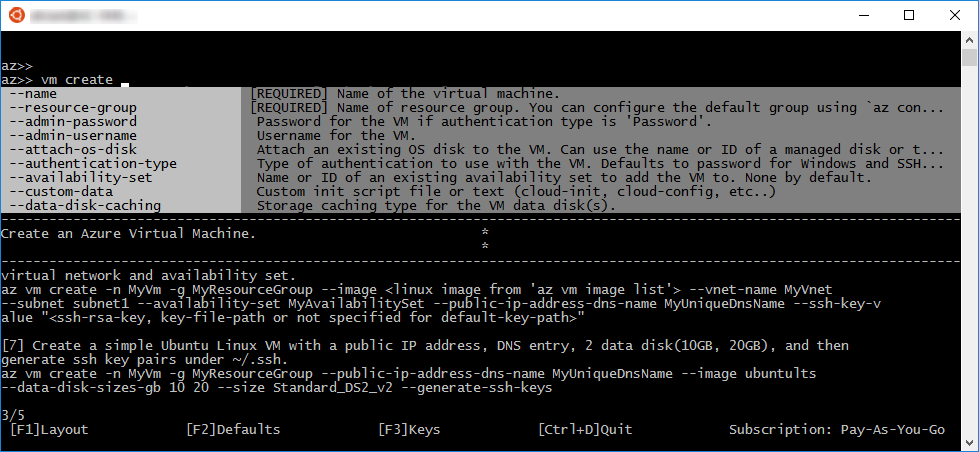

# <a name="interactive-azure-cli-20"></a><span data-ttu-id="725a2-103">Interaktivt Azure CLI 2.0</span><span class="sxs-lookup"><span data-stu-id="725a2-103">Interactive Azure CLI 2.0</span></span>

<span data-ttu-id="725a2-104">Du kan använda Azure CLI 2.0 i interaktivt läge genom att köra kommandot `az interactive`.</span><span class="sxs-lookup"><span data-stu-id="725a2-104">You can use Azure CLI 2.0 in interactive mode by running the `az interactive` command.</span></span>
<span data-ttu-id="725a2-105">När du gör det öppnas ett interaktivt gränssnitt där dina kommandon kompletteras automatisk och där du kan komma åt beskrivningar av kommandon och deras parametrar och kommandoexempel.</span><span class="sxs-lookup"><span data-stu-id="725a2-105">That places you in an interactive shell where your commands are auto-completed and you have access to descriptions of commands and their parameters and command examples.</span></span>


> [!NOTE]
> <span data-ttu-id="725a2-107">Vi använder inte standardformatet här eftersom det är svårläst mot en svart bakgrund.</span><span class="sxs-lookup"><span data-stu-id="725a2-107">We're not using the default style here, which doesn't read as well on a black background.</span></span>

<span data-ttu-id="725a2-108">Om du inte redan är inloggad på ditt konto loggar du in med kommandot `login`.</span><span class="sxs-lookup"><span data-stu-id="725a2-108">If you're not already logged in to your account, use the `login` command to do that.</span></span>

## <a name="configure"></a><span data-ttu-id="725a2-109">Konfigurera</span><span class="sxs-lookup"><span data-stu-id="725a2-109">Configure</span></span>

<span data-ttu-id="725a2-110">I interaktivt läge kan du välja att visa kommandobeskrivningar, parameterbeskrivningar och kommandoexempel.</span><span class="sxs-lookup"><span data-stu-id="725a2-110">Interactive mode optionally displays command descriptions, parameter descriptions, and command examples.</span></span>
<span data-ttu-id="725a2-111">Du kan aktivera och inaktivera beskrivningar och exempel med `F1`.</span><span class="sxs-lookup"><span data-stu-id="725a2-111">You can turn descriptions and examples on or off using `F1`.</span></span>


<span data-ttu-id="725a2-113">Du kan aktivera och inaktivera visningen av standardvärden för parametrar med `F2`.</span><span class="sxs-lookup"><span data-stu-id="725a2-113">You can turn the display of parameter defaults on or off using `F2`.</span></span>


<span data-ttu-id="725a2-115">`F3` aktiverar eller inaktiverar visningen av vissa tangentfunktioner.</span><span class="sxs-lookup"><span data-stu-id="725a2-115">`F3` toggles the display of some key gestures.</span></span>


## <a name="scope"></a><span data-ttu-id="725a2-117">Omfång</span><span class="sxs-lookup"><span data-stu-id="725a2-117">Scope</span></span>

<span data-ttu-id="725a2-118">Du kan begränsa det interaktiva läget till en specifik kommandogrupp som `vm` eller `vm image`.</span><span class="sxs-lookup"><span data-stu-id="725a2-118">You can scope your interactive mode to a specific command group like `vm` or `vm image`.</span></span>
<span data-ttu-id="725a2-119">Om du gör det tolkas alla kommandon i det omfånget.</span><span class="sxs-lookup"><span data-stu-id="725a2-119">When you do, all commands are interpreted in that scope.</span></span>
<span data-ttu-id="725a2-120">Det är en bra genväg om du utför allt arbete i den kommandogruppen.</span><span class="sxs-lookup"><span data-stu-id="725a2-120">It's a great shorthand if you're doing all your work in that command group.</span></span>

<span data-ttu-id="725a2-121">I stället för att skriva följande kommandon:</span><span class="sxs-lookup"><span data-stu-id="725a2-121">Instead of typing these commands:</span></span>

```azurecli
az>> vm create -n myVM -g myRG --image UbuntuLTS
az>> vm list -o table
```

<span data-ttu-id="725a2-122">Kan du begränsa omfånget till vm command-gruppen och skriva dessa kommandon:</span><span class="sxs-lookup"><span data-stu-id="725a2-122">You can scope to the vm command group and type these commands:</span></span>

```azurecli
az>> %%vm
az vm>> create -n myVM -g myRG --image UbuntuLTS
az vm>>list -o table
```

<span data-ttu-id="725a2-123">Du kan även begränsa omfånget till kommandon på lägre nivå.</span><span class="sxs-lookup"><span data-stu-id="725a2-123">You can scope to lower-level command groups as well.</span></span>
<span data-ttu-id="725a2-124">Du kan till exempel begränsa omfånget till `vm image` med hjälp av `%%vm image`.</span><span class="sxs-lookup"><span data-stu-id="725a2-124">You could scope to `vm image` using `%%vm image`.</span></span>
<span data-ttu-id="725a2-125">I detta fall, eftersom vi redan har begränsat omfånget till `vm`, använder vi `%%image`.</span><span class="sxs-lookup"><span data-stu-id="725a2-125">In this case, since we're already scoped to `vm`, we would use `%%image`.</span></span>

```azurecli
az vm>> %%image
az vm image>>
```

<span data-ttu-id="725a2-126">Därifrån kan vi ändra tillbaka omfånget till `vm` med hjälp av `%%..`, eller använda roten som omfång med bara `%%`.</span><span class="sxs-lookup"><span data-stu-id="725a2-126">At that point, we can pop the scope back up to `vm` using `%%..`, or we can scope to the root with just `%%`.</span></span>

```azurecli
az vm image>> %%
az>>
```

## <a name="query"></a><span data-ttu-id="725a2-127">Fråga</span><span class="sxs-lookup"><span data-stu-id="725a2-127">Query</span></span>

<span data-ttu-id="725a2-128">Du kan köra en JMESPath-fråga mot resultatet från det sista kommandot som du körde.</span><span class="sxs-lookup"><span data-stu-id="725a2-128">You can execute a JMESPath query on the results of the last command that you executed.</span></span>
<span data-ttu-id="725a2-129">Till exempel kan du när du har skapat en virtuell dator kontrollera att den har etablerats.</span><span class="sxs-lookup"><span data-stu-id="725a2-129">For example, after you create a VM, you can make sure it has fully provisioned.</span></span>

```azurecli
az>> vm create --name myVM --resource-group myRG --image UbuntuLTS --no-wait
az>> ? [*].provisioningState
```

```
[
  "Creating"
]
```

<span data-ttu-id="725a2-130">Mer information om hur du skickar frågor mot resultatet från kommandon finns i [Använda JMESPath-frågor med Azure CLI 2.0](query-azure-cli.md).</span><span class="sxs-lookup"><span data-stu-id="725a2-130">To learn more about querying the results of your commands, see [Query command results with Azure 2.0](query-azure-cli.md).</span></span>

## <a name="bash-commands"></a><span data-ttu-id="725a2-131">Bash-kommandon</span><span class="sxs-lookup"><span data-stu-id="725a2-131">Bash commands</span></span>

<span data-ttu-id="725a2-132">Du kan köra shell-kommandon utan att lämna interaktivt läge med hjälp av `#[cmd]`.</span><span class="sxs-lookup"><span data-stu-id="725a2-132">You can run shell commands without leaving interactive mode using `#[cmd]`.</span></span>

```azurecli
az>> #dir
```

## <a name="examples"></a><span data-ttu-id="725a2-133">Exempel</span><span class="sxs-lookup"><span data-stu-id="725a2-133">Examples</span></span>

<span data-ttu-id="725a2-134">Vissa kommandon har flera exempel.</span><span class="sxs-lookup"><span data-stu-id="725a2-134">Some commands have lots of examples.</span></span>
<span data-ttu-id="725a2-135">Du kan bläddra till nästa sida med exempel med `CTRL-N` och till föregående sida med `CTRL-Y`.</span><span class="sxs-lookup"><span data-stu-id="725a2-135">You can scroll to the next page of examples using `CTRL-N` and the previous page using `CTRL-Y`.</span></span>



<span data-ttu-id="725a2-137">Du kan också visa ett specifikt exempel med `::#`.</span><span class="sxs-lookup"><span data-stu-id="725a2-137">You can also look at a specific example using `::#`.</span></span>

```azurecli
az>> vm create ::8
```
